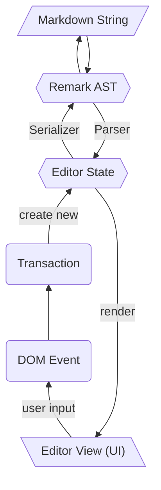

# Architecture

Milkdown is built on top of mainly two frameworks: [Prosemirror](https://prosemirror.net/) and [Remark](https://remark.js.org/).
Because of this, you can think of [parser](/#/parser) and [serializer](/#/serializer) as the bridges to transform between remark AST and prosemirror editor state.

So, for every moment of a milkdown editor, it will have an editor state, this state can both render a UI and be transformed into markdown string.
For any changes to the editor, it won't change UI directly, but create a new editor state and render a new UI by that state.

