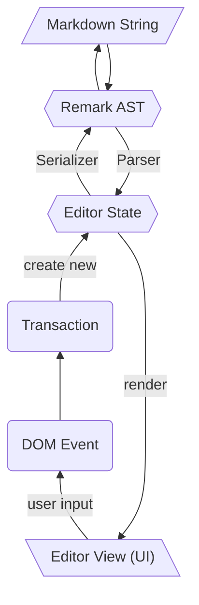
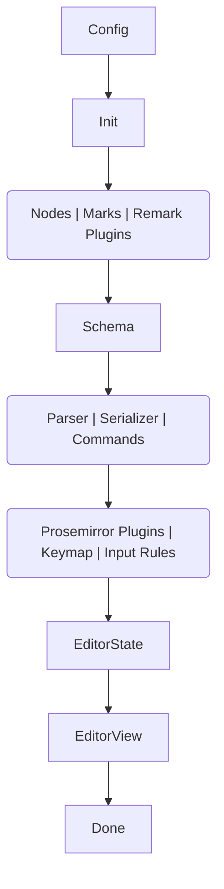

# 架构

Milkdown 主要基于两个框架构建： [Prosemirror](https://prosemirror.net/) 和 [Remark](https://remark.js.org/)。
正因如此, 你可以认为[解析器](/#/zh-hans/parser) 和 [序列化器](/#/zh-hans/serializer) 是能够让 remark 抽象语法树和 Prosemirror 的编辑器状态同步的桥梁。

所以，对于任意时刻的 Milkdown 编辑器，它都有一个编辑器状态(editor state)，这一状态既可以渲染出编辑器的 UI，也可以用来被转换为 markdown 字符串。
任何对编辑器的变更都不会直接修改编辑器的 UI，它会先创建一个新的编辑器状态，然后通过这一状态渲染新的 UI。

## 生命周期

在 Milkdown 内部, 它有许多[内置插件](/#/zh-hans/internal-plugins) 来控制编辑器的状态， 它可以通过下图来描述:

