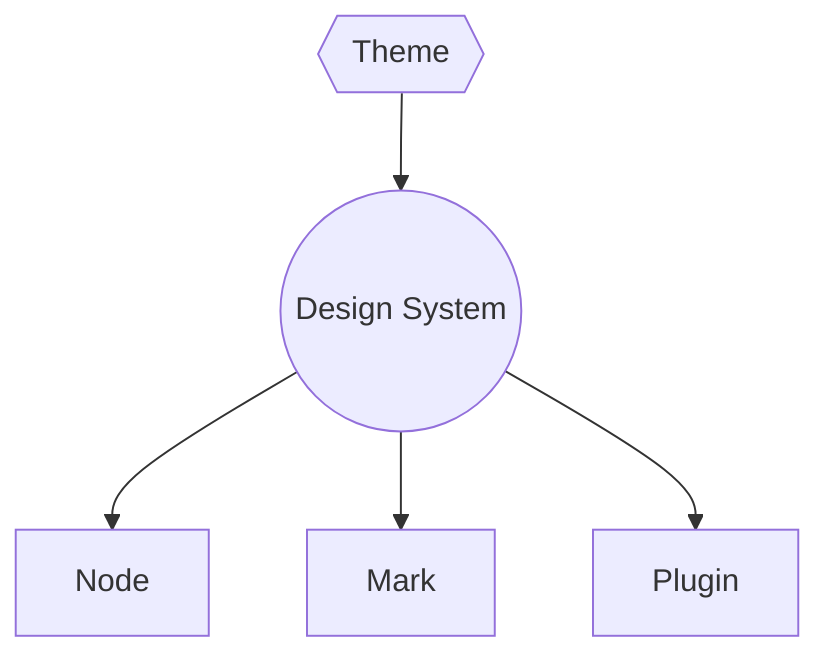

# 设计系统

设计系统是主题的基础。



设计系统像是一种约定。主题实现设计系统，主题可以被不同的 nodes, marks 和插件消费。

在[编写主题插件](/#/zh-hans/writing-theme-plugins)一节中，我们已经学习了主题的定义方式。在本节中将展示如何使用它。

## 主题工具

设计系统可以通过`themeToolCtx`来访问。

```typescript
import { themeToolCtx } from '@milkdown/core';

import { createProsePlugin } from '@milkdown/utils';

export const myProsemirrorPlugin = createProsePlugin((_, utils) => {
    const themeTool = utils.ctx.get(themeToolCtx);

    // ...
});
```

### font

```typescript
const { typography, code } = themeTool.font;

css`
    p {
        font-family: ${typography};
    }

    code {
        font-family: ${code};
    }
`;
```

### size

```typescript
const { radius, lineWidth } = themeTool.size;

css`
    border-radius: ${radius}px;
    border: ${lineWidth}px solid #000;
`;
```

### palette

调色板用于根据当前主题生成颜色。

```typescript
const { palette } = themeTool;

css`
    background: ${palette('background')};
    // 0.8 means it has 0.8 opacity.
    color: ${palette('primary', 0.8)};
`;
```

### mixin

```typescript
const { scrollbar, shadow, border } = themeTool.mixin;

css`
    ul {
        ${scrollbar()};
    }
    div {
        ${shadow()};
        ${border()};
    }
`;
```

### slots

```typescript
const { icon } = themeTool.slots;

const loadingIcon = icon('loading');
div.appendChild(loadingIcon);
```
