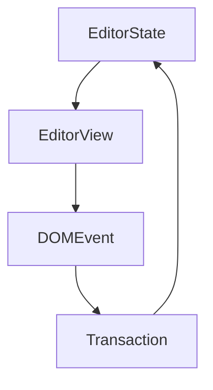

# Milkdown


> Milkdown is a WYSIWYG markdown editor framework.
>
> :baby_bottle: Here is the [repo] (right click to open link). \
> We ~~only support commonmark~~. GFM is also supported!

You can check the output markdown text in **two columns editing**.

-   Features
    -   [x] 📝 **WYSIWYG Markdown** - Write markdown in an elegant way
    -   [x] 🎨 **Themable** - Theme can be shared and used with npm packages
    -   [x] 🎮 **Hackable** - Support your awesome idea by plugin
    -   [x] 🦾 **Reliable** - Built on top of [prosemirror] and [remark]
    -   [x] ⚡ **Slash & Tooltip** - Write fast for everyone, driven by plugin
    -   [x] 🧮 **Math** - LaTeX math equations support, driven by plugin
    -   [x] 📊 **Table** - Table support with fluent ui, driven by plugin
    -   [x] 📰 **Diagram** - Diagram support with [mermaid](https://mermaid-js.github.io/mermaid/#/), driven by plugin
    -   [x] 🍻 **Collaborate** - Shared editing support with [yjs], driven by plugin
    -   [x] 💾 **Clipboard** - Support copy and paste markdown, driven by plugin
    -   [x] :+1: **Emoji** - Support emoji shortcut and picker, driven by plugin
-   Made by
    -   Programmer: [Mirone][mirone]
    -   Designer: [Meo][meo]

---

You can add `inline code` and code block:

```javascript
function main() {
    console.log('Hello milkdown!');
}
```

> Tips: use `Mod-Enter` to exit blocks such as code block.

---

You can type `||` and a `space` to create a table:

| First Header   |   Second Header    |
| -------------- | :----------------: |
| Content Cell 1 |  `Content` Cell 1  |
| Content Cell 2 | **Content** Cell 2 |

---

Math is supported by [TeX expression](https://en.wikipedia.org/wiki/TeX).

Now we have some inline math: $E = mc^2$. You can click to edit it.

Math block is also supported.

$$
\begin{aligned}
T( (v_1 + v_2) \otimes w) &= T(v_1 \otimes w) + T(v_2 \otimes w) \\
T( v \otimes (w_1 + w_2)) &= T(v \otimes w_1) + T(v \otimes w_2) \\
T( (\alpha v) \otimes w ) &= T( \alpha ( v \otimes w) ) \\
T( v \otimes (\alpha w) ) &= T( \alpha ( v \otimes w) ) \\
\end{aligned}
$$

You can type `$$` and a `space` to create a math block.

---

Use [emoji cheat sheet](https://www.webfx.com/tools/emoji-cheat-sheet/) such as `:+1:` to add emoji[^1].

You may notice the emoji filter while inputting values, try to type `:baby` to see the list.

---

Diagrams is powered by [mermaid](https://mermaid-js.github.io/mermaid/#/).

You can type ` ```mermaid ` to add diagrams.



---

Have fun!

[repo]: https://github.com/Saul-Mirone/milkdown
[prosemirror]: https://prosemirror.net/
[yjs]: https://docs.yjs.dev/
[remark]: https://github.com/remarkjs/remark
[mirone]: https://github.com/Saul-Mirone
[meo]: https://www.meo.cool/

[^1]: We use [tweet emoji](https://twemoji.twitter.com) to make emoji can be viewed cross platforms.
