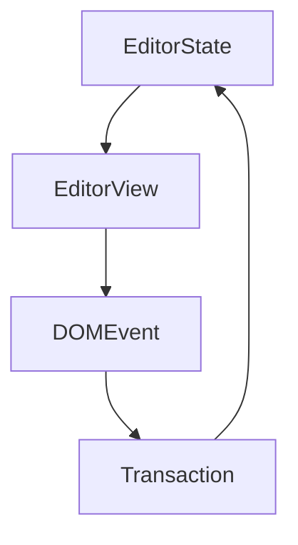

# Milkdown


> Milkdown 是一个所见即所得的编辑器框架。
>
> :baby_bottle: 这里是[代码仓库] (点击右键打开链接)。\
> 我们 ~~只支持 commonmark~~. GFM 也支持！

您可以在**双栏编辑模式**中看到 markdown 文本。

-   特性
    -   [x] 📝 **所见即所得的 Markdown** - 以一种优雅的方式编写 markdown
    -   [x] 🎨 **可定制主题** - 主题可以通过 npm 包安装和共享
    -   [x] 🎮 **可交互** - 通过插件支持你的脑洞
    -   [x] 🦾 **值得信赖** - 基于[prosemirror](https://prosemirror.net/) 和 [remark](https://github.com/remarkjs/remark)构建
    -   [x] ⚡ **斜线指令和工具条** - 让任何人都可以使用，通过插件
    -   [x] 🧮 **数学支持** - LaTeX 数学公式支持，通过插件
    -   [x] 📊 **表格支持** - 拥有流畅的 ui 的表格支持，通过插件
    -   [x] 📰 **图表支持** - 基于[mermaid](https://mermaid-js.github.io/mermaid/#/)的图表支持，通过插件
    -   [x] 🍻 **协同编辑** - 基于[yjs](https://docs.yjs.dev/)的协同编辑支持，通过插件
    -   [x] 💾 **剪贴板** - 支持 markdown 格式的复制粘贴，通过插件
    -   [x] :+1: **Emoji** - 支持 emoji 快捷指令和选择器，通过插件
-   作者
    -   开发者: [Mirone][mirone]
    -   设计师: [Meo][meo]

---

你可以添加行内代码例如 `inline code` 和代码块：

```javascript
function main() {
    console.log('Hello milkdown!');
}
```

> Tips: 使用`Mod-Enter`来退出块级元素，例如代码块。

---

你可以输入`||`和一个空格来创建表格：

| 表头 1 |   表头 2   |
| ------ | :--------: |
| 内容 1 | ~~内容 1~~ |
| 内容 2 | **内容** 2 |

---

数学公式通过 [TeX 表达式](https://en.wikipedia.org/wiki/TeX)支持。

这里我们有行内公式： $E = mc^2$，你可以点击并编辑它。

数学公式块也是支持的。

$$
\begin{aligned}
T( (v_1 + v_2) \otimes w) &= T(v_1 \otimes w) + T(v_2 \otimes w) \\
T( v \otimes (w_1 + w_2)) &= T(v \otimes w_1) + T(v \otimes w_2) \\
T( (\alpha v) \otimes w ) &= T( \alpha ( v \otimes w) ) \\
T( v \otimes (\alpha w) ) &= T( \alpha ( v \otimes w) ) \\
\end{aligned}
$$

你可以输入`$$`和一个空格来创建数学公式块。

---

使用 [emoji 快捷指令](https://www.webfx.com/tools/emoji-cheat-sheet/) 例如 `:+1:` 来添加 emoji.

在输入时，你也许注意到了 emoji 过滤器，尝试输入`:baby`来查看它。

---

图表由 [mermaid](https://mermaid-js.github.io/mermaid/#/)驱动。

你可以输入 ` ```mermaid ` 来添加图表。



---

Have fun!

[代码仓库]: https://github.com/Saul-Mirone/milkdown
[prosemirror]: https://prosemirror.net/
[yjs]: https://docs.yjs.dev/
[remark]: https://github.com/remarkjs/remark
[mirone]: https://github.com/Saul-Mirone
[meo]: https://www.meo.cool/
